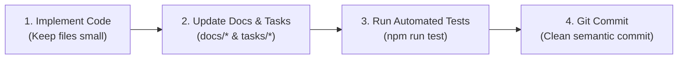

# AGENTS.md — Developer & AI Agent Guidelines

> ⚠️ **DISCLAIMER: ENTIRELY AI-GENERATED APPLICATION**  
> This project is designed, built, and maintained autonomously by AI agents under human direction.  
> Every agent interacting with this repository MUST adhere strictly to the rules and conventions below.

---

## 1. Core Principles: Modularity & Agent-Friendly Codebases

AI agents thrive when codebases are transparent, predictable, and easy to parse within tight context windows. Large monolithic files (>300 lines) cause hallucination, incomplete context, and high edit collision rates.

### 1.1 Small, Single-Responsibility Files
- **File Length Target**: Keep source files **under 200 lines** whenever possible. If a file approaches 300 lines, refactor it into cohesive sub-modules.
- **Single Responsibility**: Each file must do one thing well (e.g., `hasher.ts` hashes files, `resizer.ts` resizes images, `dal.ts` coordinates database queries).
- **Avoid God Objects**: Decompose complex services into separate orchestrators, worker units, and pure utility functions.

### 1.2 Clear Naming & File Conventions
| Category | Convention | Example |
|---|---|---|
| **Files & Directories** | `kebab-case` | `image-pipeline.ts`, `database-schema.ts`, `picker-window.ts` |
| **React Components** | `PascalCase` file & export | `StickerGrid.tsx`, `InspectorDrawer.tsx`, `SearchBar.tsx` |
| **TypeScript Types & Interfaces** | `PascalCase` | `StickerItem`, `SearchFilterOptions`, `ImageTier` |
| **Functions & Variables** | `camelCase` | `upsertItem()`, `calculateSha256()`, `copyItemToClipboard()` |
| **Constants & Enums** | `UPPER_SNAKE_CASE` or `PascalCase` | `MAX_THUMBNAIL_SIZE`, `DEFAULT_HOTKEY` |
| **Test Files** | Adjacent or mirrored in `tests/` with `.test.ts` | `hasher.test.ts`, `dal.test.ts` |

### 1.3 Predictable Directory Layout & Cross-Linking
Always link files using markdown file links (`[filename.ts](file:///c:/Projects/sticker-database-manager/src/...)`) in tasks and docs so agents can jump directly to code locations:

```
src/
├── main/
│   ├── windows/          # Window lifecycles (one file per window)
│   ├── services/
│   │   ├── database/     # SQLite connection, migrations, queries
│   │   ├── imaging/      # Sharp resizing, hashing, format checks
│   │   ├── ingestion/    # File watcher, batch scanner
│   │   ├── gemini/       # Vision client, prompt schema, queue
│   │   └── clipboard/    # Native clipboard writing
│   ├── shortcuts/        # OS global hotkeys
│   └── ipc/              # Typed IPC handler registrations
├── preload/              # Context bridges (one file per window)
├── renderer/             # React frontends (decoupled by view)
│   ├── manager/          # Manager app (components, hooks, state)
│   ├── picker/           # Quick Picker app (components, hooks, state)
│   └── styles/           # Tailwind styling
└── types/                # Central contracts shared across Main & Renderers
```

---

## 2. Mandatory Contributor Workflow Rule

Every agent completing work on a task **must strictly execute this 4-step checklist** before concluding their turn:



1. **Update Documentation**: If any schemas, parameters, or behaviors changed, update the relevant file in [`docs/`](file:///c:/Projects/sticker-database-manager/docs/).
2. **Update Task & Milestone Tracking**: Mark items as completed in [`tasks/`](file:///c:/Projects/sticker-database-manager/tasks/) and update [`tasks/milestones.md`](file:///c:/Projects/sticker-database-manager/tasks/milestones.md).
3. **Run Automated Test Suite**: Run `npm run test` (and `npm run build` if relevant) to ensure zero regressions and clean TypeScript compilation.
4. **Git Commit**: Commit with conventional commit messages (e.g. `feat(...)`, `fix(...)`, `docs(...)`, `test(...)`).

---

## 3. TypeScript & Code Standards

- **Strict Mode Enabled**: No `any` unless explicitly wrapping untyped external vendor boundaries.
- **Explicit Return Types**: All exported functions and service methods must have explicit return type signatures.
- **Fail Fast, Fail Safely**: Wrap OS operations (file I/O, SQLite operations, native clipboard calls, Gemini network requests) in explicit try/catch blocks with descriptive error logging.
- **Pure Helpers**: Keep computational helpers (math, formatting, string sanitization) free of side effects and Electron dependencies so they can be unit-tested in isolation without mocking Electron.

---

## 4. Running Commands

In Windows PowerShell:
- Use `;` instead of `&&` to chain multiple commands (e.g. `npm run test; git status`).
- Check output and logs for background tasks as required by the platform.
