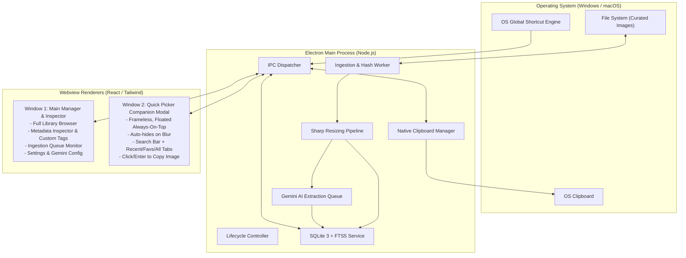

# System Overview & Architecture Design

This document details the multi-process architecture, IPC communications, window lifecycles, and backend service contracts for StickerVault.

---

## 1. Process Architecture

StickerVault uses an Electron architecture splitting responsibilities cleanly between a main Node.js process and two separate Webview renderers:

---

## 2. Window Lifecycles

### 2.1 Main Manager Window
- **Role**: Heavy-duty administrative interface for managing the vault, viewing status, editing tags, configuring folders, and adjusting settings.
- **Attributes**: Standard framed window, minimizable, maximizable, remember window bounds across sessions.
- **Closing Behavior**: Can be closed or minimized to the system tray so that the Quick Picker companion stays active in the background.

### 2.2 Quick Picker Window (Companion Overlay)
- **Role**: Instant-access, lightweight sticker selector (modeled after the native `Win + .` emoji panel or Raycast/Alfred).
- **Attributes**:
  - `frame: false` (frameless, clean modern border with subtle drop shadow).
  - `alwaysOnTop: true` (floats above games, IDEs, Discord, browsers).
  - `skipTaskbar: true` (does not clutter taskbar or Alt-Tab switcher).
  - `resizable: false` (standard compact dimension, e.g. 420px width × 520px height).
  - `transparent: true` (styled with frosted acrylic / mica or dark glass aesthetic).
- **Summon & Dismissal**:
  - **Summon**: Triggered globally by keyboard shortcut (`Win + /` on Windows, `Control + /` on macOS; customizable). Window appears at center of current active monitor or near cursor. Search input is auto-focused.
  - **Dismissal**: Window automatically hides on `blur` (clicking outside) or pressing `Escape`.
  - **Action**: Clicking any sticker or hitting `Enter` copies the selected tier (Sticker or Emoji) directly to the system clipboard and immediately hides the picker.

### 2.3 System Tray & 24/7 Companion Daemon
- **Role**: Maintains the Quick Picker companion ready in memory even when the Main Manager window is closed.
- **Attributes**:
  - Native system tray icon (`resources/tray-icon.png` / `tray-icon@2x.png`).
  - Context menu: *Show Quick Picker*, *Open Manager*, *Scan Vault Now*, separator, *Quit StickerVault*.
  - Left-click triggers the Quick Picker companion immediately.
- **Window Interception**:
  - Closing the Manager window hides it rather than terminating the Electron process, ensuring 24/7 companion availability with zero startup lag.

---

## 3. IPC Communication Protocol

Renderers communicate securely with the Main process using `contextBridge` with strongly typed IPC channels:

| Channel | Direction | Payload | Return / Action |
|---|---|---|---|
| `db:search` | Invoke | `{ query: string, tab: 'recent'\|'favorites'\|'all', limit: number, ... }` | Paginated sticker items with metadata & variants |
| `db:getFacets` | Invoke | None | Frequency-ranked franchises, characters, and tags |
| `db:getItem` | Invoke | `id: string` | Full sticker record by ID |
| `db:toggleFavorite` | Invoke | `itemId: string` | Toggle favorite boolean state |
| `db:updateMetadata` | Invoke | `{ itemId: string, metadata: ... }` | Updates metadata, locks fields, returns boolean |
| `db:deleteItems` | Invoke | `itemIds: string[]` | Batch atomic deletion of items, variants, and FTS entries |
| `db:bulkAddTags` | Invoke | `{ itemIds: string[], tags: string[] }` | Batch association of tags across selected items |
| `db:bulkRemoveTags` | Invoke | `{ itemIds: string[], tags: string[] }` | Batch removal of tags across selected items |
| `db:bulkToggleFavorite` | Invoke | `{ itemIds: string[], favorite: boolean }` | Batch favorite setting across selected items |
| `db:bulkSetCustomAttribute` | Invoke | `{ itemIds: string[], key: string, value: string }` | Batch custom attribute assignment |
| `clipboard:copyItem` | Invoke | `{ itemId: string, tier: 'sticker'\|'emoji' }` | Writes image to OS clipboard, updates usage |
| `clipboard:copyAndPasteItem` | Invoke | `{ itemId: string, tier: 'sticker'\|'emoji' }` | Writes image to OS clipboard, hides picker, simulates paste |
| `vault:scan` | Invoke | `{ folderPath?: string, forceReprocess?: boolean }` | Starts folder scan & returns `{ started: boolean }` |
| `vault:ingestFiles` | Invoke | `filePaths: string[]` | Ingests drag-and-dropped image files |
| `vault:showItemInFolder` | Invoke | `filePath: string` | Opens native file explorer focusing file |
| `vault:progress` | Event | `IngestionProgressEvent` (Main $\rightarrow$ Renderer) | Ingestion/resizing/tagging progress stream |
| `gemini:tagItem` | Invoke | `itemId: string` | Triggers AI vision tagging for single item |
| `gemini:batchTag` | Invoke | None | Starts background batch AI tagging for untagged items |
| `gemini:getUntaggedCount` | Invoke | None | Count of untagged/pending items |
| `gemini:testKey` | Invoke | `{ apiKey: string, model?: string }` | Validates Gemini API key and model |
| `settings:get` / `save` | Invoke | Settings object | Loads or saves application settings |
| `dialog:selectFolder` | Invoke | None | Native folder selection dialog |
| `window:hidePicker` | Invoke | None | Hides floating companion modal |
| `window:openManager` | Invoke | None | Focuses or creates Main Manager window |

---

## 4. Clipboard & Native Auto-Paste Engine

When a user selects an item in the Quick Picker, the Main process coordinates multi-format clipboard writing and automated focus-paste simulation:

1. **Native Image Writing**: Electron's `clipboard.writeImage(nativeImage.createFromPath(filePath))` writes the uncompressed DIB / PNG bitmap to the OS clipboard.
2. **Compatibility Fallback**: In addition to the image bitmap, the local file URL and file path are written into the clipboard payload to guarantee support across Discord, Slack, Telegram, WhatsApp Web, Word, and graphic editors.
3. **Usage Increment**: Records `copy_count = copy_count + 1` and updates `last_copied_at = CURRENT_TIMESTAMP` to immediately rank the item at the top of the **Recent** tab.
4. **Native Keystroke Simulation (`copyAndPasteItem`)**:
   - The Quick Picker window is hidden, returning OS window focus to the user's prior application.
   - After an 80ms window-manager settling delay, a simulated paste keystroke is fired via OS-native tools:
     - **Windows**: VBScript `SendKeys "^v"` executed through `cscript //nologo` with PowerShell fallback.
     - **macOS**: AppleScript `osascript -e 'tell application "System Events" to keystroke "v" using command down'`.
     - **Linux**: `xdotool key --clearmodifiers ctrl+v`.
   - Controlled by the user-configurable `autoPasteOnSelect` setting (with `Shift+Enter` available to invert/override).

---

## 5. Quick Picker Full Keyboard Navigation Architecture

The companion modal implements a window-level event capture architecture (`usePickerKeyboard.ts`, `keyboard-navigation.ts`):
- **Window-Level Routing**: Captures keystrokes at `window` scope so navigation and shortcuts work regardless of which sub-element has DOM focus.
- **Alphanumeric Focus Routing**: Printable characters typed while navigating the grid automatically focus and route into the search input.
- **2D Grid Navigation**: Arrow keys (`↑↓←→`), `Home`, `End`, and `PageUp`/`PageDown` calculate coordinates across 4-column rows with boundary clamping.
- **DOM Auto-Scroll**: Selected items automatically call `element.scrollIntoView({ block: 'nearest' })` keeping the cursor visible in the viewport.
- **Power Shortcuts**:
  - `Ctrl+1` / `Ctrl+2` / `Ctrl+3`: Instant tab switching (Recent / Favorites / All).
  - `Ctrl+T`: Resolution toggle (Sticker ↔ Emoji).
  - `Ctrl+S`: Star/favorite toggle directly in the database.
  - `Enter` vs `Shift+Enter`: Auto-paste execution vs copy-only override.
  - `Escape`: Two-stage dismiss (clears search query if non-empty; hides window if empty).
