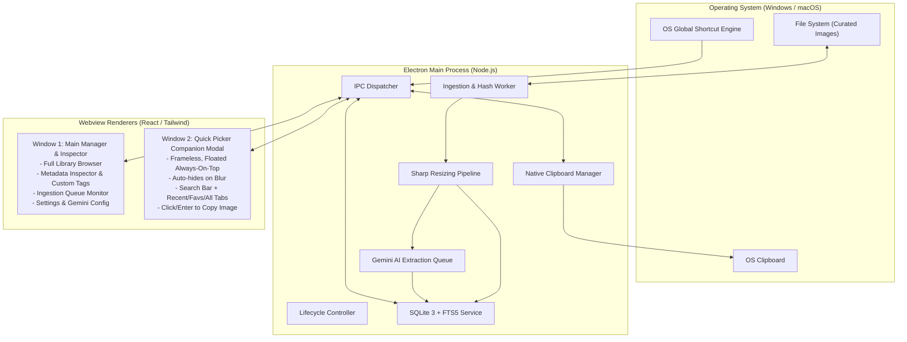

# System Overview & Architecture Design

This document details the multi-process architecture, IPC communications, window lifecycles, and backend service contracts for StickerVault.

---

## 1. Process Architecture

StickerVault uses an Electron architecture splitting responsibilities cleanly between a main Node.js process and two separate Webview renderers:

---

## 2. Window Lifecycles

### 2.1 Main Manager Window
- **Role**: Heavy-duty administrative interface for managing the vault, viewing status, editing tags, configuring folders, and adjusting settings.
- **Attributes**: Standard framed window, minimizable, maximizable, remember window bounds across sessions.
- **Closing Behavior**: Can be closed or minimized to the system tray so that the Quick Picker companion stays active in the background.

### 2.2 Quick Picker Window (Companion Overlay)
- **Role**: Instant-access, lightweight sticker selector (modeled after the native `Win + .` emoji panel or Raycast/Alfred).
- **Attributes**:
  - `frame: false` (frameless, clean modern border with subtle drop shadow).
  - `alwaysOnTop: true` (floats above games, IDEs, Discord, browsers).
  - `skipTaskbar: true` (does not clutter taskbar or Alt-Tab switcher).
  - `resizable: false` (standard compact dimension, e.g. 420px width × 520px height).
  - `transparent: true` (styled with frosted acrylic / mica or dark glass aesthetic).
- **Summon & Dismissal**:
  - **Summon**: Triggered globally by keyboard shortcut (`Alt + Shift + V` on Windows, `Option + Shift + V` on macOS). Window appears at center of current active monitor or near cursor. Search input is auto-focused.
  - **Dismissal**: Window automatically hides on `blur` (clicking outside) or pressing `Escape`.
  - **Action**: Clicking any sticker or hitting `Enter` copies the selected tier (Sticker or Emoji) directly to the system clipboard and immediately hides the picker.

---

## 3. IPC Communication Protocol

Renderers communicate securely with the Main process using `contextBridge` with strongly typed IPC channels:

| Channel | Direction | Payload | Return / Action |
|---|---|---|---|
| `db:search` | Invoke | `{ query: string, tab: 'recent'\|'favorites'\|'all', limit: number, offset: number }` | Paginated sticker items with metadata & variants |
| `db:toggleFavorite` | Invoke | `{ itemId: string, isFavorite: boolean }` | Success boolean |
| `db:updateMetadata` | Invoke | `{ itemId: string, metadata: Partial<ItemMetadata> }` | Updated item record |
| `clipboard:copyItem` | Invoke | `{ itemId: string, tier: 'sticker'\|'emoji' }` | Writes image buffer to clipboard, increments usage |
| `vault:scan` | Invoke | `{ folderPath?: string, forceReprocess?: boolean }` | Ingestion job ID & initial status |
| `vault:onProgress` | Event | None (Main -> Renderer push) | Scan/Resizing/AI tagging progress events |
| `gemini:testKey` | Invoke | `{ apiKey: string }` | Validation status |
| `window:hidePicker` | Invoke | None | Closes/hides the floating picker |

---

## 4. Native Clipboard Dispatcher

When a user selects an item in the Quick Picker, the Main process executes a multi-format clipboard write:

1. **Native Image Writing**: Electron's `clipboard.writeImage(nativeImage.createFromPath(filePath))` writes the uncompressed DIB / PNG bitmap to the OS clipboard.
2. **Compatibility Fallback**: In addition to the image bitmap, the local file URL and file path are written into the clipboard payload to guarantee support across Discord, Slack, Telegram, WhatsApp Web, Word, and graphic editors.
3. **Usage Increment**: Records `copy_count = copy_count + 1` and updates `last_copied_at = CURRENT_TIMESTAMP` to immediately place the item at the top of the **Recent** tab.
