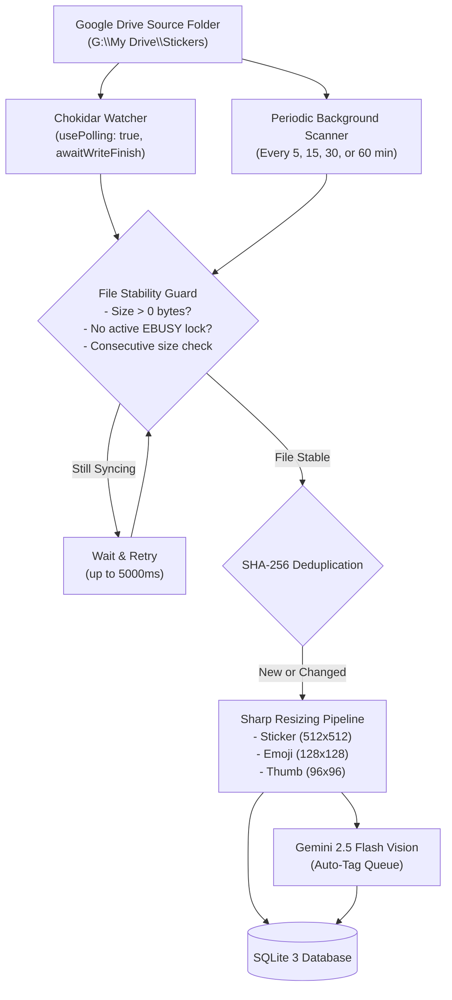

# Cloud Drive Compatibility & Periodic Sync Specifications

This document defines how StickerVault handles cloud-synced storage folders, specifically **Google Drive for Desktop**, **OneDrive**, and **Dropbox**, alongside the periodic background ingestion engine.

---

## 1. Google Drive for Desktop Architecture

Google Drive for Desktop uses a virtual file system rather than standard local disk directories:

| Platform | Typical Mount Location | File System Mechanics |
|---|---|---|
| **Windows** | `G:\My Drive\` or `G:\Shared drives\` | Virtual drive letter mapped via Projected File System / virtual driver |
| **macOS** | `~/Library/CloudStorage/GoogleDrive-<email>/` | FileProvider / FUSE virtual mount |

### 1.1 Challenges with Virtual Cloud Storage
1. **Cloud Placeholders / Sparse Files**: When files are set to "Stream", only lightweight metadata placeholders exist until the file is accessed.
2. **In-Progress Sync Locks**: When a user drops a file or Google Drive downloads a file synced from another device, the file handle remains locked with `EBUSY` or `EPERM` during transfer, or reports `0 bytes` temporarily.
3. **Missed OS Events**: Native OS file system notifications (`ReadDirectoryChangesW` on Windows, `FSEvents` on macOS) are frequently bypassed by Google Drive's internal sync engine when files are synced from remote clients.

---

## 2. StickerVault Cloud Compatibility Solution

To ensure 100% reliable ingestion of stickers placed into a Google Drive folder:

### 2.1 File Stability Guard (`cloud-sync-helper.ts`)
Before attempting to read or process any file:
- `waitUntilFileStable(filePath, maxWaitMs)` monitors file size across consecutive checks.
- Attempts a read-only handle check (`fs.promises.open(filePath, 'r')`).
- If Google Drive is currently writing the file, it backs off and retries (up to 5 seconds) until the file is stable and fully synced.

### 2.2 Adaptive Polling Watcher
If the user selects a folder matching known cloud storage patterns (e.g. `Google Drive`, `My Drive`, `CloudStorage`, `OneDrive`), StickerVault automatically enables `usePolling: true` with `awaitWriteFinish: { stabilityThreshold: 2000, pollInterval: 250 }`.

### 2.3 Periodic Background Scanner
To guarantee no files are missed when Google Drive syncs in the background:
- The user can configure a periodic scan interval in Settings (default: **every 15 minutes**, or 5, 30, 60 minutes).
- The periodic scanner runs lightweight incremental scans without freezing the UI.
- Any newly discovered image or GIF is imported, resized, and immediately queued for Gemini AI vision tagging.
