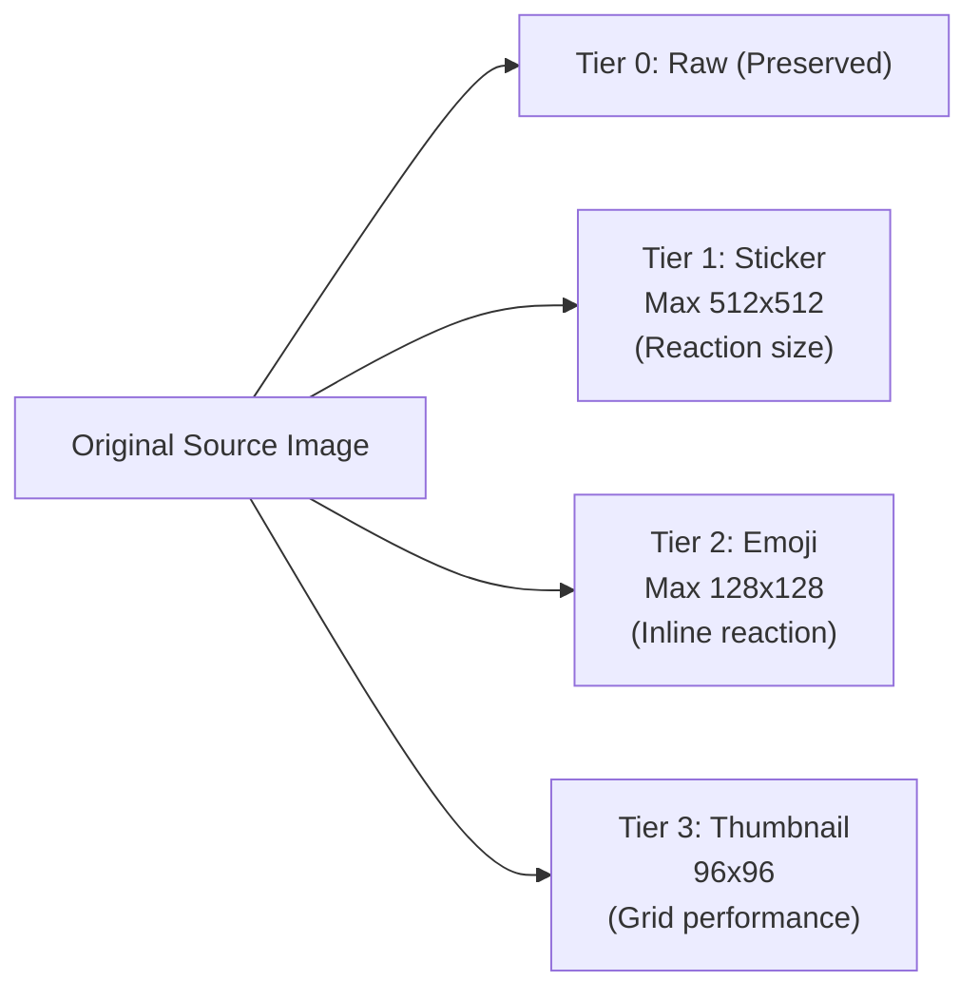

# Image Standards & Resizing Specifications

This document defines the technical standards for ingested and processed visual assets in StickerVault.

---

## 1. Supported Input Formats

| Format | Extensions | Animated Support | Notes |
|---|---|---|---|
| **PNG** | `.png` | APNG supported | Lossless, transparent alpha channel |
| **JPEG** | `.jpg`, `.jpeg` | No | Baseline photographic images |
| **WebP** | `.webp` | Yes (Animated WebP) | High compression ratio with transparency |
| **GIF** | `.gif` | Yes (Multi-frame) | Classic animated format; frame delays preserved |

---

## 2. Standard Output Tiers

Every source image is preserved in its original form (`raw`), and generated into three standardized optimized tiers:

### 2.1 Tier 1: Sticker Standard (`sticker`)
- **Primary Use Case**: Full-size messaging reactions for apps like Discord (Sticker size: 320–512px), Slack, Telegram, WhatsApp.
- **Bounding Box**: Max width `512px`, max height `512px`.
- **Aspect Ratio**: Always preserved (never stretched or cropped).
- **Format**:
  - **Static images**: WebP (Quality: 88, lossless: false) or PNG fallback.
  - **Animated images**: Animated WebP or optimized animated GIF (max 50 frames, frame rate capped to 30fps if exceeding).
- **Max File Size Target**: `< 500 KB` (compatible with Discord/Slack custom sticker limits).

### 2.2 Tier 2: Emoji Standard (`emoji`)
- **Primary Use Case**: Compact inline text reactions (emoji replacement).
- **Bounding Box**: Max width `128px`, max height `128px`.
- **Aspect Ratio**: Always preserved.
- **Format**:
  - **Static images**: WebP / PNG (with full alpha transparency).
  - **Animated images**: Animated GIF / WebP (optimized color palette).
- **Max File Size Target**: `< 128 KB`.

### 2.3 Tier 3: UI Thumbnail (`thumb`)
- **Primary Use Case**: High-performance UI rendering in the Manager virtualized grid and the Quick Picker modal.
- **Bounding Box**: Exactly `96 × 96px` (square fit or aspect-ratio fitted inside canvas).
- **Format**: Static WebP (Quality: 80). For animated assets, the 1st frame is extracted as static thumbnail to avoid CPU overhead when rendering grids of hundreds of items.
- **Max File Size Target**: `< 15 KB`.

---

## 3. Resizing Rules & Pipeline

1. **Downscaling Only**: If a source image is smaller than the target bounding box (e.g. 64x64 input), it is NOT upscaled to prevent pixelation/blurriness; it is kept at native resolution for that tier.
2. **Animation Handling**:
   - Animated GIFs are processed frame-by-frame via `sharp({ animated: true })`.
   - Frame durations (delay timings) must be strictly maintained.
   - Large animated GIFs (>10MB or >100 frames) are capped or warned to prevent memory exhaustion during processing.
3. **Deduplication**:
   - Ingestion calculates SHA-256 hash of the source file.
   - If an identical file exists, re-processing is skipped and variants are linked to the existing record.
4. **Color Profile & Alpha**:
   - Alpha channel (transparency) is preserved across all formats.
   - sRGB color profile conversion applied to prevent color shifting across displays.
