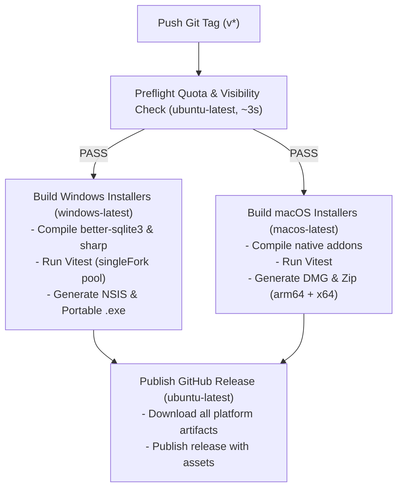

# Multiplatform Packaging & Release Pipeline

This document specifies the packaging configurations, installer formats, automated GitHub Actions release pipelines, and cost protection safeguards for Sticker Chest.

---

## 1. Supported Platform Targets & Artifacts

Sticker Chest produces production-ready native installers and standalone portable binaries:

| Platform | Format | Output File | Features |
|---|---|---|---|
| **Windows (x64)** | **NSIS Installer** | `StickerChest.Setup.<version>.exe` | Desktop shortcut, Start menu entry, custom install directory, clean uninstaller. |
| **Windows (x64)** | **Portable Exe** | `StickerChest.<version>.exe` | Standalone executable for USB drives or zero-install environments. |
| **macOS (arm64)** | **Apple Disk Image** | `StickerChest-<version>-arm64.dmg` | Native Apple Silicon (M1/M2/M3/M4) DMG with drag-to-`/Applications` symlink. |
| **macOS (x64)** | **Apple Disk Image** | `StickerChest-<version>.dmg` | Native Intel x64 DMG with drag-to-`/Applications` symlink. |
| **macOS (Dual)** | **Zipped Bundle** | `StickerChest-<version>-*.zip` | Standalone zipped `.app` bundles for direct execution. |
| **Updates** | **Auto-Update YAML** | `latest.yml`, `latest-mac.yml` | Distribution manifests for electron-updater compatibility. |

---

## 2. Icon Generation & Assets Pipeline

High-resolution branded application icons are dynamically generated via [`scripts/generate-icons.js`](file:///c:/Projects/sticker-database-manager/scripts/generate-icons.js) using `sharp`:
- `resources/icon.ico`: Multi-layer Windows icon embedding 16px, 24px, 32px, 48px, 64px, 128px, and 256px layers.
- `resources/icon.png`: 512×512 master high-resolution icon.
- `resources/tray-icon.png` & `tray-icon@2x.png`: 16×16 and 32×32 monochrome template icons for system tray bars.

To regenerate icons at any time:
```bash
npm run generate-icons
```

---

## 3. GitHub Actions CI/CD Architecture

Native C++ Node addons ([`better-sqlite3`](https://github.com/WiseLibs/better-sqlite3) and [`sharp`](https://sharp.pixelplumbing.com/)) must be compiled on their respective native host operating systems. The GitHub Actions release pipeline ([`.github/workflows/release.yml`](file:///c:/Projects/sticker-database-manager/.github/workflows/release.yml)) coordinates a dual-runner matrix:



---

## 4. Quota & Cost Protection System

To prevent unintended cloud billing or exhaustion of monthly GitHub Actions runner minutes:

### 4.1 Public Repository Policy
- Public repositories enjoy **100% free, unlimited** GitHub-hosted standard runners (Ubuntu, Windows, macOS).
- The repository is maintained with public visibility to eliminate runner billing overhead.

### 4.2 Automated Preflight Guard
- **Preflight Job**: Before spinning up heavy matrix builders (which take 5–10 minutes), a lightweight check runs on `ubuntu-latest` in ~3 seconds.
- **Fail-Safe Interception**: If the repository is ever detected as `private`, the build halts immediately unless `ALLOW_PRIVATE_BUILDS=true` is explicitly configured.

### 4.3 CLI Quota Inspector
- Command: `npm run check-quota` executes [`scripts/check-quota.js`](file:///c:/Projects/sticker-database-manager/scripts/check-quota.js).
- Inspects repository visibility and live Actions billing minutes before any builds fire.
- Integrated directly into [`scripts/release.js`](file:///c:/Projects/sticker-database-manager/scripts/release.js).

### 4.4 Concurrency Auto-Cancellation
- Both CI and Release workflows define `concurrency: cancel-in-progress: true`.
- If a new commit or tag is pushed while a build is running, superseded jobs are cancelled immediately to prevent runner waste.

---

## 5. Release Workflow Execution

To initiate a new production release:
```bash
# Automates quota verification, version bump, and git tagging:
node scripts/release.js <version>

# Push tag to trigger automated multiplatform build & release:
git push origin main --tags
```
